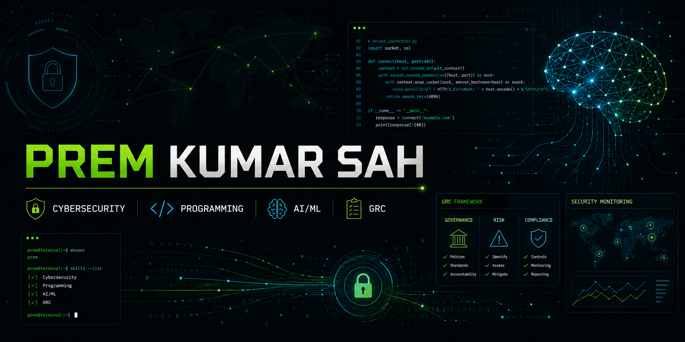

# 

  

---

## About Me

I'm **Prem Kumar Sah**, an aspiring cybersecurity professional with interests in **Cybersecurity, Programming, AI/ML, and Governance, Risk & Compliance (GRC)**.

I am a **BSc. in Computer Systems Engineering** student and have hands-on experience with **Linux, Networking, Python, Virtualization, IT Support, and Cybersecurity**.

My goal is to continuously build practical technical and security knowledge while developing expertise in cybersecurity and GRC.

---

## Certifications

  
<strong>CRTOM</strong>

  Certified Red Team Operations Management (CRTOM) — RedTeamLeaders, 2025

  
<strong>Certified Cyber Investigator</strong>

  CSI-Linux — EchoThisLab, 2025

  
<strong>Mastercard</strong>

  Security Awareness Team Analyst — Forage, 2025

  
<strong>Tata Consultancy Services</strong>

  Cybersecurity Analyst Virtual Experience — Forage, 2025

  
<strong>Cisco</strong>

  Introduction to Cybersecurity — Cisco, 2025
  Creating Compelling Reports — Cisco, 2025

---

## Skills & Tools

**Cybersecurity & Networking:**  

**Programming & Systems:**  

**AI/ML:**  

---

## Connect With Me

---

  <i>Learning, building, and working toward a more secure digital future.</i>

